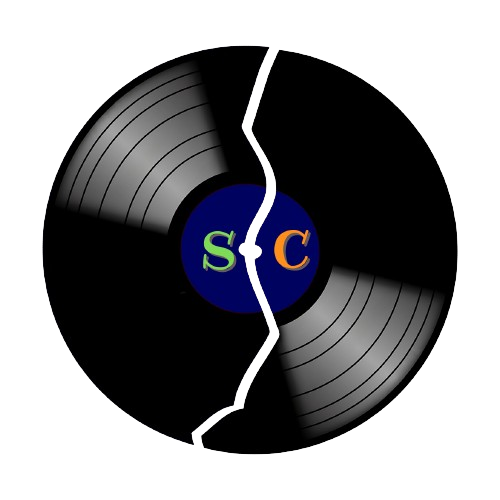

# Soundcrack 

## Descrição

Soundcrack é um projeto full-stack de um e-commerce de discos de músicas. Ele é composto por um frontend desenvolvido com Vite e TypeScript, e um backend utilizando Fastify e MongoDB.

## Tecnologias Utilizadas
### Backend

- Fastify
- Mongoose
- Zod
- Bcrypt

### Frontend

- Vite
- TypeScript
- Axios
- ColorThief


### Banco de Dados

- MongoDB

## Como Rodar o Projeto

### Pré-requisitos

- Node.js instalado
- Docker instalado

### Rodando o Backend

1. Navegue até o diretório do backend:
   ```sh
   cd /C:/manu/soundcrack/backend
   ```
2. Inicie o MongoDB com Docker Compose:
   ```sh
   docker-compose up -d
   ```
3. Instale as dependências:
   ```sh
   npm install
   ```
4. inicie a seed: 
   ```sh 
   npm run seed
   ``` 
5. Inicie o servidor de desenvolvimento:
   ```sh
   npm run dev
   ```

### Rodando o Frontend

1. Navegue até o diretório do frontend:
   ```sh
   cd /C:/manu/soundcrack/frontend
   ```
2. Instale as dependências:
   ```sh
   npm install
   ```
3. Inicie o servidor de desenvolvimento:
   ```sh
   npm run dev
   ```

Agora você pode acessar o frontend em `http://localhost:5173` e o backend em `http://localhost:3000`.
